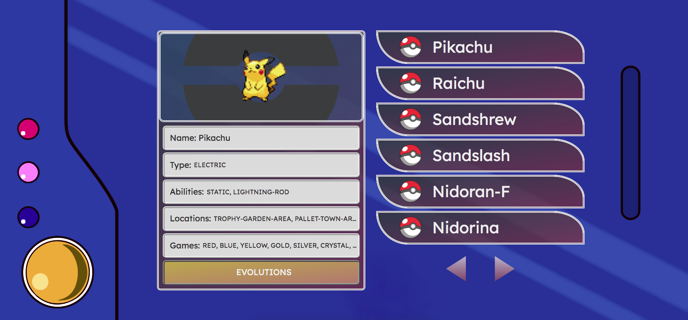

<h1 align="center">
  
</h1>

<h4 align="center">
  A pokedex built consuming pokeAPI, made in Vue.js and some other things :D
</h4>

<div align="center">
   
</div>

## Getting started

### Requirements
Before start, you need to install:
[Git](https://git-scm.com), [Node.js](https://nodejs.org/en/)(LTS version)..

```bash
# Clone this repo to your local machine using:
$ git clone git@github.com:Afonsofn/pokedex.git

# Go to pokedex folder;
$ cd pokedex

# Install project dependencies;
$ npm install
// or
$ yarn install

# Run project in development mode;
$ npm run dev
// or
$ yarn dev

```

## Tools employed
All third-party libraries and API selected are production-grade and at its most recent stable releases.

* [Vue.js](https://reactjs.org/)
* [Sass](https://sass-lang.com/)
* [axios](https://axios-http.com/)      
* [pokeAPI](https://pokeapi.co/docs/v2)      


---

Made by Raul Afonso 👋 [Check out my LinkedIn](https://www.linkedin.com/in/afonsofn/)


